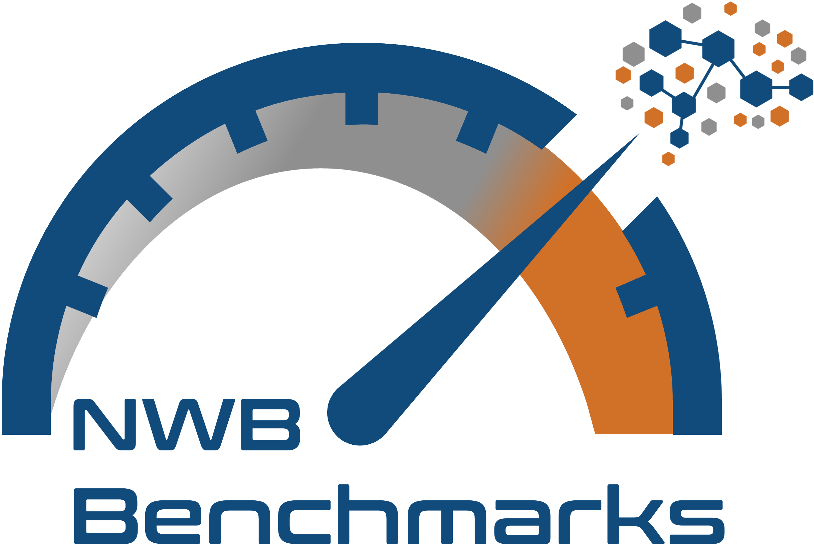

# NWB Benchmarks

Benchmark suite for NWB performances using a customization of [airspeed velocity](https://asv.readthedocs.io/en/stable/).


## Dandisets

This project utilizes several dandisets.

HDF5: https://dandiarchive.org/dandiset/000717

Zarr: https://dandiarchive.org/dandiset/000719

LINDI: https://gui-staging.dandiarchive.org/dandiset/213889


## Building the Documentation

Public documentation can be found via `readthedocs`: https://nwb-benchmarks.readthedocs.io/en/latest/

To generate them locally, first install the additional packages required by executing the command...

```
pip install -r docs/requirements-rtd.txt
```

then build the docs by executing the command...

```
sphinx-build -M html docs docs/build
```
